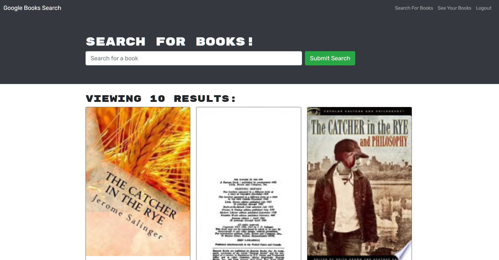

# MERN Stack Book Search

## Description

A MERN stack web application where users can create accounts, search for their favorite books, and add them to a favorites list.
  
--- 

## https://github.com/lancebailey26/bookMERN

--- 

## Installation

npm install, npm run develop

--- 

## Usage

Create an account, search for books, and add them to your favorites!

## Credits

n/a

## Copyright Lance Bailey 10/2/2021 License: MIT License